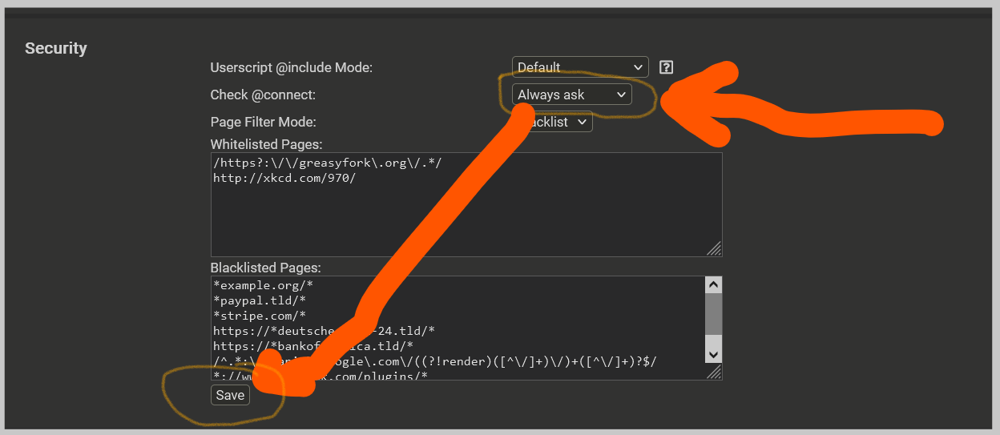
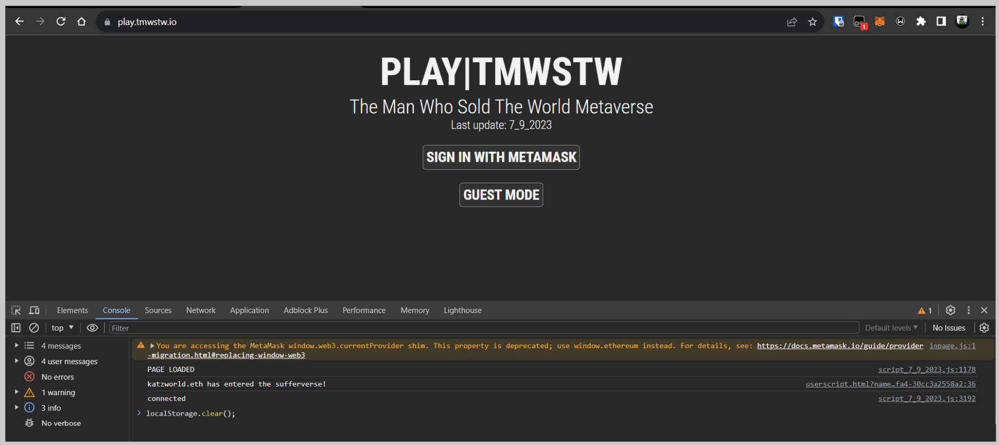
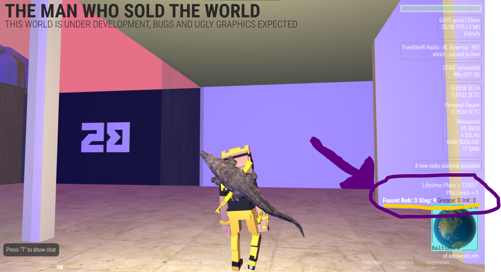

# WalkingtheWorld-v2
make the a map on the tmwstw metaverver and MORE 

this runs in browser with the TamperMonkey Extension provides overlay and ui rework for
The Man Who Sold The World Metaverse please check out the project https://tmwstw.io/ dude is KILLING IT !!! 

NOT SEEING ANYHTING IN FULL OVERLAY CHECK THESE SETTINGS !
inside tampermonkey settings click beginner box under config box  

this is the permissions to run checks and returns 
the faucet status of the plot your currently 
moving around in the metaverse 
api is run from https://api-pusher.onrender.com using the API from the king
if you would like to run your own api to serve this check out 
https://github.com/katzworld/api-thing for source and setup 
**Press F12 and inside console and enter code as image**
if that still dont work try below 
 clear local storage after updates to make sure it plays nicey nice with the no stale data 
hit me up on discord or twitter space will walk you through it if you still have problems 
--| LeaderBoard in the works |--

 NEW OVERLAY AS OF 5/5/24 CINCO DE MAYO UPDATE !

current look with full overlay

color HUD for compass and directions 

OG IMAGE FOR THE HISTORY

